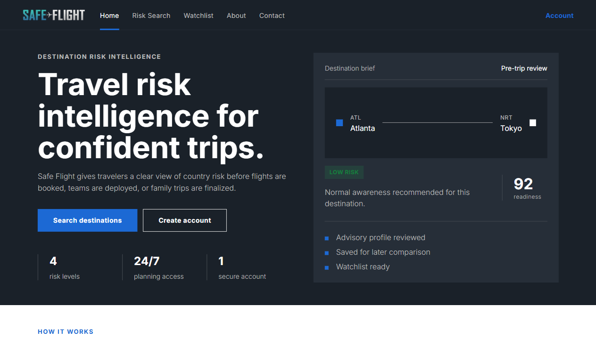
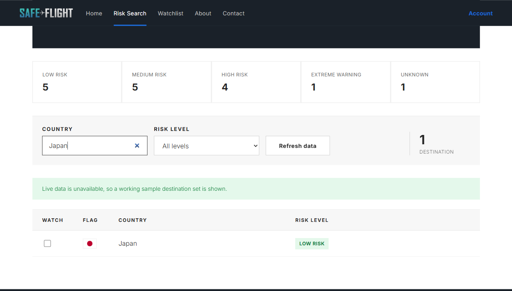
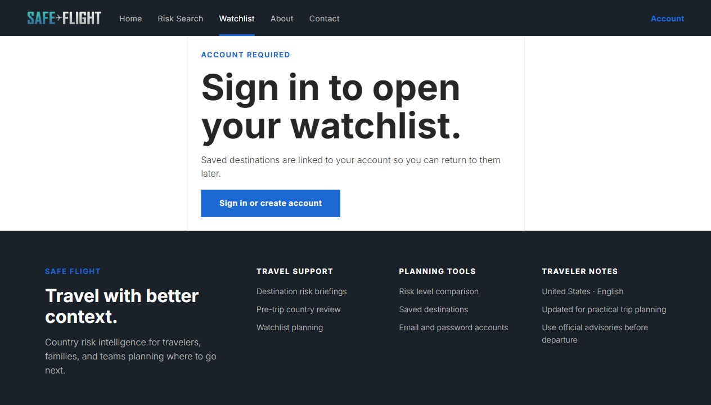
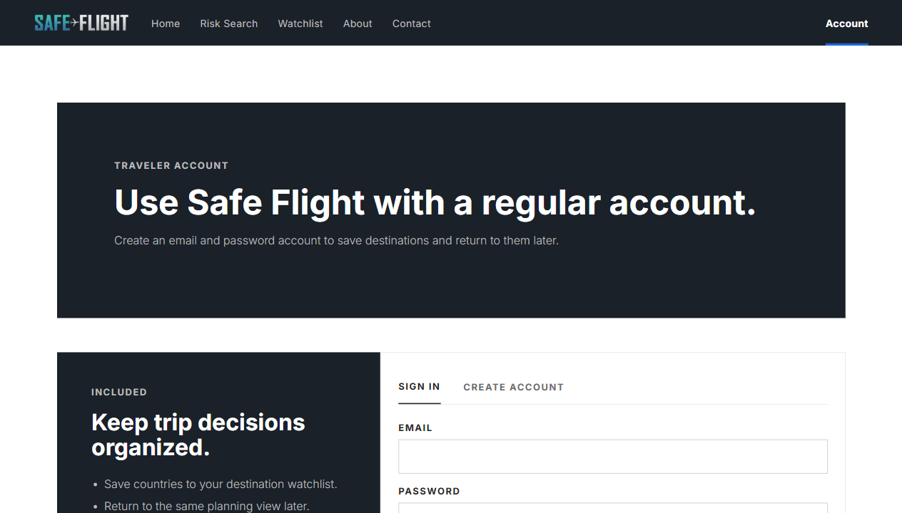
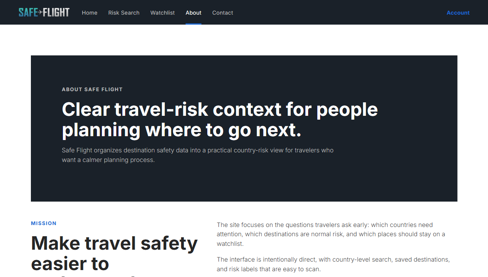
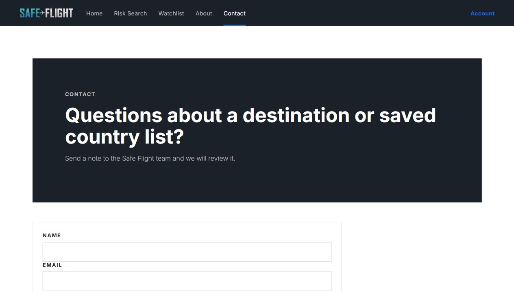

# Safe Flight

Safe Flight is a travel risk planning website that helps users review destination safety before booking or departing. The app presents country risk levels in a polished travel-service interface, supports searchable destination data, and lets users save countries to a personal watchlist with a regular email and password account.

The current UI uses a modern corporate travel style with a dark navigation bar, strong editorial hero sections, clean data tables, country flag imagery, and responsive layouts for desktop and mobile.

## Features

- Search and filter countries by destination name and risk level.
- View destination risk categories with scannable badges.
- Display country flags in the Risk Search table.
- Save destinations to a personal watchlist.
- Create and use a regular local account without OAuth.
- Use fallback sample data when live advisory APIs are unavailable.
- Responsive navigation, account, contact, and informational pages.

## Technologies Used

- React 18
- React Router
- Axios
- CSS3
- Inter web font
- Web Crypto API
- Local Storage
- Python 3.11
- Flask
- PyMongo
- MongoDB
- Requests
- python-decouple
- AirLabs API
- Travel Advisory API
- Create React App
- Pipenv

## Screenshots

The screenshots below show each primary page of the website.

| Home | Risk Search |
| --- | --- |
|  |  |

| Watchlist | Account |
| --- | --- |
|  |  |

| About | Contact |
| --- | --- |
|  |  |

## Project Structure

```text
safe-flight-website/
  client/             React frontend
  server/             Flask API and MongoDB helpers
  docs/screenshots/   Portfolio screenshots used by this README
```

## Setup Instructions

### Prerequisites

- Node.js and npm
- Python 3.11
- Pipenv
- MongoDB running locally on `mongodb://localhost:27017/`

### Backend

```bash
cd server
pipenv install
pipenv run python server.py
```

Optional API environment variables can be added in `server/.env`:

```bash
AIRLABS=your_airlabs_api_key
AIRLABS_BASE=https://airlabs.co/api/v9/
TA_BASE=https://www.travel-advisory.info/api
```

If live API data is unavailable, the frontend still provides a working sample destination set for the Risk Search page.

### Frontend

```bash
cd client
npm install
npm start
```

Open the app at:

```text
http://localhost:3000
```

### Production Build

```bash
cd client
npm run build
```

The optimized build is generated in `client/build`.
